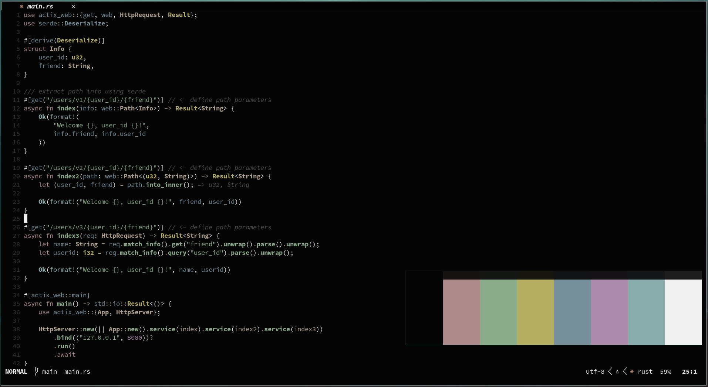

<h1 align="center">itabyss.vim</h1>

<p align="center"


</p>

***

<p align="center" 

 

</p>

***

## Installation

### [packer.nvim](https://github.com/wbthomason/packer.nvim)

```lua
use ("nubilfi/itabyss.nvim")
```

Then set your `colorscheme` to `colorscheme itabyss`.

You might also want to check [`itabyss.lua`](https://github.com/nubilfi/itabyss.vim/autoload/lualine/themes) for your lualine themes.
